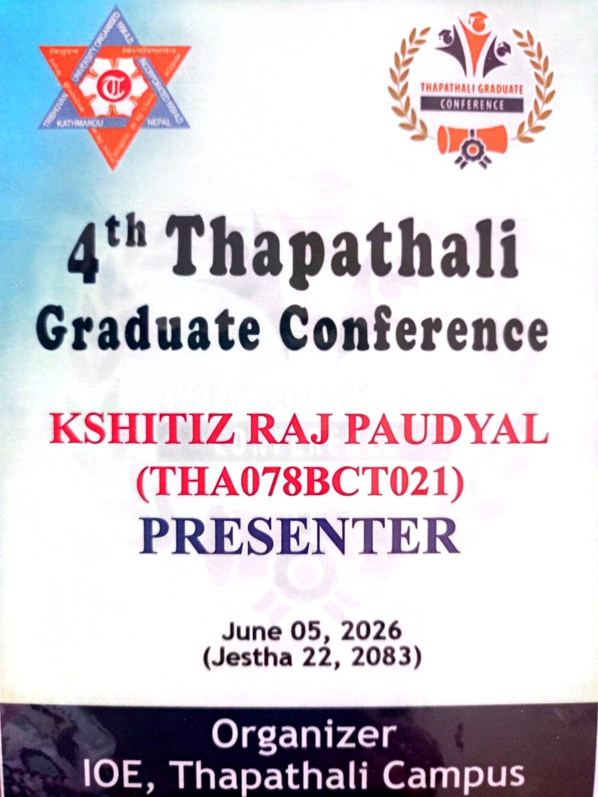
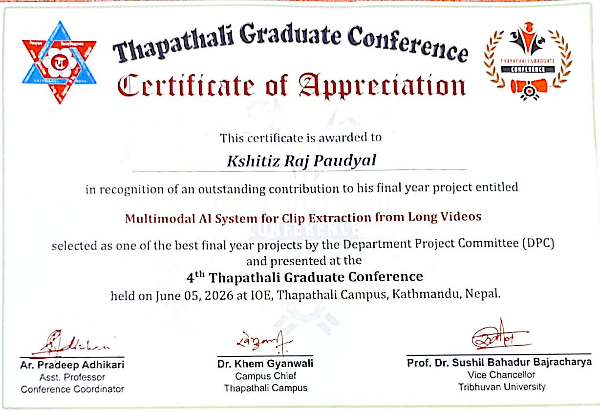

# 🎬 Semantic Video Synthesis with BERT

> **🏆 Awarded as one of the Best Projects on Campus**  
> **🎤 Presented at the Thapathali Graduate Conference**  

<div align="center">
  
  
  <br>
  
  <br>
  <em>(Please place your image files: <code>thapathali_conference.jpg</code>, <code>presenter_card.jpg</code>, and <code>certificate.jpg</code> in the root directory to display them here)</em>
</div>

---

## 📖 Overview
This project implements a pipeline for semantic video synthesis, utilizing BERT for text embeddings, TransNetV2 for scene analysis, Whisper for ASR, and CLIP for importance scoring. The system processes raw video, extracts meaningful segments, analyzes emotions via audio, and synthesizes a concise, meaningful output video.

---

## 🚀 Key Findings & Performance Analysis
Based on our processing time breakdown, here are the core findings:

- **Processing Efficiency:** A 20-minute input video takes approximately **~30 minutes** to process using a combination of CPU (Intel i7) and CUDA GPU.
- **Scalability:** The pipeline scales linearly ($O(n)$) with video duration. Utilizing GPU acceleration provides a **3.0x speedup** compared to CPU-only execution.
- **Major Bottlenecks:**
  - **Importance Scoring (33.3%):** Extracting CLIP features, Whisper ASR per clip, and audio spectral analysis.
  - **Shot Detection & ASR (26.7%):** Full-video TransNetV2 inference and initial Whisper transcriptions.

---

## 🛠️ Usage & Integration Guidelines

### 1️⃣ Preprocessing
Extract frames, audio, and metadata from an input video.
1. Place your input video in the `input_video/` directory.
2. Run the extractor script:
```bash
cd preprocessing
python ffmpeg_extractor.py input_video/input.mp4 extracted/audio extracted/Frames extracted/metadata
```

### 2️⃣ TransNet Scene Analysis
Identifies scene changes (using a threshold of 0.6) and clips the segments.
1. Clone and setup TransNetV2:
```bash
git clone https://github.com/soCzech/TransNetV2
cd TransNetV2
```
2. Run the scene extractor:
```bash
python transnet_scene_extractor.py ../input_video/input.mp4
```
*Note: Ensure `tensorflow`, `matplotlib`, and `numpy` are installed. This will output scene summaries to `preprocessing/extracted/scene_summary.csv` and JSON.*

### 3️⃣ Audio & Emotion Analysis
1. Configure `run_whisper.py` with your target audio path.
2. Run the script to divide the audio into segments with timestamps and calculate MFCC scores via `librosa`.
3. Emotion sorting: Use `organize.py` with the `Audio_Speech_Actors_01-24` dataset to categorize audio (happy, sad, angry, calm) into `emotiondataset` for model training.

### 4️⃣ Web Application Server
To interact with the results via the web UI:
```bash
uvicorn server:app --host 127.0.0.1 --port 8000
```
Once running, access the web application at [http://127.0.0.1:8000](http://127.0.0.1:8000).

---
*Created and presented with pride at the Thapathali Graduate Conference.*